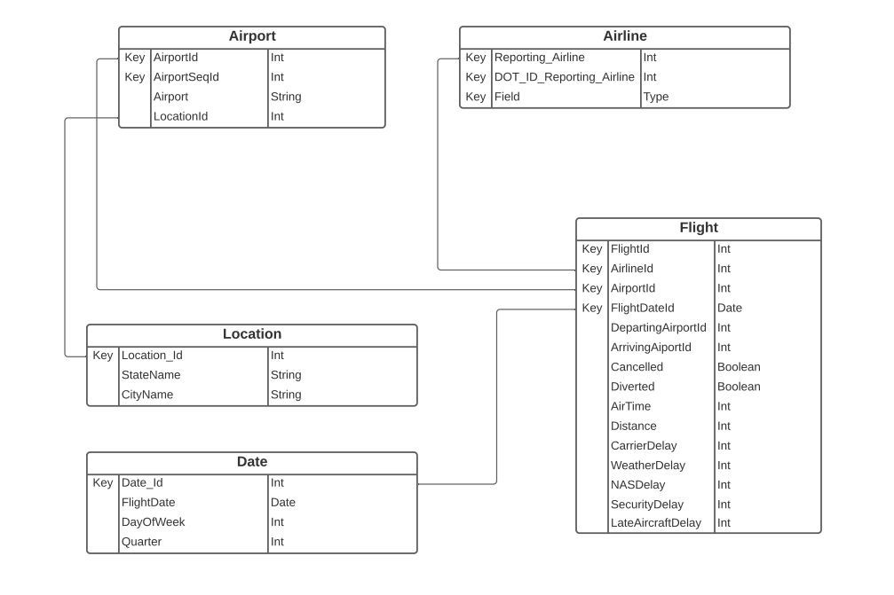

# Database Project (https://bit.ly/3B90Ul6)

Performing trend analysis of overarching trends in flight delays by delay type, airline, departing airport, etc.

### Project consists of 5 phases
  - Phase I: Requirements Analysis
    - Propose and understand an appropriate project topic.
    - Identify its main data management needs.
    - Explore and motivate its potential for interesting queries.
    - Analyze the needed user functionality
  - Phase II: Entity-Relationship Diagram Design and User Interface 
    Design
  - Phase III: Database Schema Construction
  - Phase IV: Project Software Implementation
  - Phase V: Project Software Demonstration

https://transtats.bts.gov/DL_SelectFields.asp?gnoyr_VQ=FGJ&QO_fu146_anzr=b0-gvzr

### Database Model:

### Tasks:
 1. Database - Schema, inserting data, queries
 2. Backbend(Flask) - Create endpoints
 3. Frontend(Vue and/or React) - Charts, pages, requests to backend

